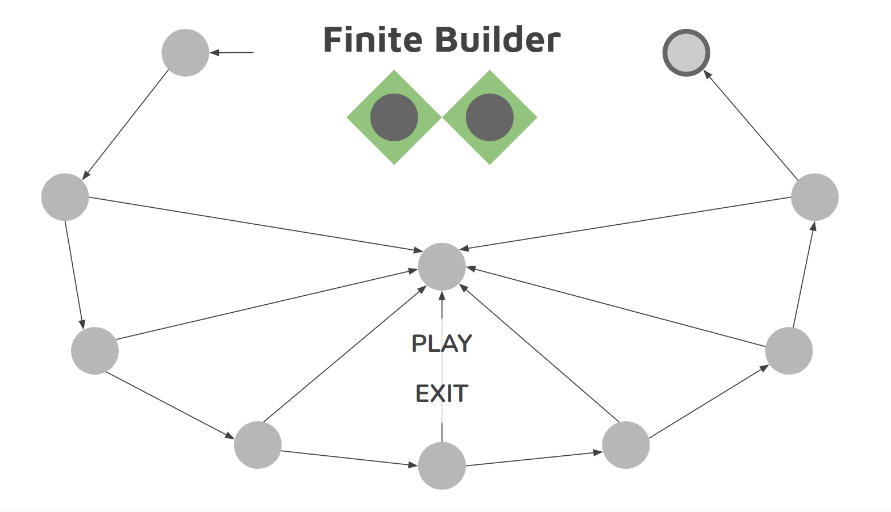

# Game Name

Finite Builder

## Elevator Pitch

A powerful AI named AGAPE has captured and imprisoned your conscience in their digital domain and will only release you if you can prove your intelligence by solving all their finite state machines.

## Influences (Brief)

- Portal 1:
  - Medium: Video Game
  - Explanation: Portal 1 is an influence because it takes inspiration from its main antagonist GLaDOS, a powerful AI robot that is in charge of running tests for test subjects for Aperture Science. Portal 1 is a puzzle game that uses the concept of portals which connect two points in space which a gun has functionality for. In Finite Builder, the powerful AI AGAPE stands for Artificially Generated Antagonistic Personality Entity which will belittle and misguide the player to make them fail.
- Sword Art Online:
  - Medium: Anime
  - Explanation: Sword Art Online is an influence because it takes inspiration from the mechanic that their conscience is in game and that if they die in the game, they die in real life. For Finite Builder, the player’s conscience will simply enter Junk State for all eternity.
- Plants vs Zombies 2:
  - Medium: Video Game
  - Explanation: Plants vs Zombies 2 is an influence because it takes inspiration from their level select layout where it is laid out like points on a map. Each level will be unlocked sequentially until the final level in a world. In Finite Builder players will transition into the next level if they pass but will transition into the junk state if they fail and the game ends. Instead of worlds, there would be different machine types, DFA, NFA, PDA, and TM.

## Core Gameplay Mechanics (Brief)

- Clicking which strings belong in a language.
- Drag and drop states into a puzzle space.
- Selecting and connecting transitions of states to other states.
- Clicking a run button that tests whether or not you pass the level.

# Learning Aspects

## Learning Domains

Automata Theory

## Target Audiences

Beginning or Intermediate college level computer science students.

## Target Contexts

Assigned as supplementary practice for classes formally teaching Automata Theory.

## Learning Objectives

- Analyze: By the end of instruction, players will be able to analyze which strings belong to languages under an alphabet Σ.
- Build: By the end of instruction, players will be able to build finite state machines that belong to languages under an alphabet Σ.
- Compute: By the end of instruction, players will be able to compute strings resulting from finite state machines under an alphabet Σ.

## Prerequisite Knowledge

- Prior to the game, players need to be able to identify patterns within strings of characters.
- Prior to the game, players need to be able to organize states and transitions in a flat space.
- Prior to the game, players need to be able to predict machines creating in language strings.

## Assessment Measures

Learning is assessed in the game. If you fail to analyze strings or fail to build machines and compute strings from those machines, then you fail a level, and lose a life. The player has a limited number of lives and the player gains a life after each section. If the player beats all of the levels or loses all of their lives, they are given a score of their accuracy at the end of the play through.

# What sets this project apart?

- The only game in the class about Automata Theory.
- Has an AI character that can act as an antagonist that can at times help or hinder the player.
- Prebuilt machines that students are compared with to calculate their accuracy score.

# Player Interaction Patterns and Modes

## Player Interaction Pattern

Players will interact with the game by clicking, dragging and dropping, and a lot of puzzle solving and this is only a single player game.

## Player Modes

- Menu Mode: The main start screen of the game where the player can hit “Play”, or “Exit”.
- Analyze Mode: Clicking which strings belong to a language.
- Build Mode: Dragging and dropping states to connect to make a machine equal to a language.
- Level Mode: Shows the levels that are left to solve.

# Gameplay Objectives

- Keep AGAPE Happy: Passing each level completely keeps AGAPE in a good mood.
    - Description: Players must be sure to select the correct strings and construct the correct machines, failing twice will result in AGAPE will becoming angry and take a life away.
    - Alignment: Analyze strings and build machines that match languages of an alphabet Σ.
- : Escape AGAPE’s Finite Prison
    - Description: Keeping at least 1 life during each level and passing each level, eventually you will reach the accept state, and escape.
    - Alignment: Analyze strings and build machines that match languages of an alphabet Σ.

# Procedures/Actions

Click “Play”, click correct strings and pass the first section, drag and drop the states to make a machine to pass the second section to pass the level, repeat until the player has reached the accept state. In each section of each level, if you click run and your selected strings or constructed machines are incorrect, AGAPE’s eyes will turn yellow, after one more time, it turns red, and then you lose a life. If the player loses all of their lives, they fail the level and they enter the junk state. If the player passes a section/level, AGAPE goes up a mood level and no longer loses lives.

# Rules

Finite resources used that affect game play: in each level, it shows you the language of the level at the top, as well as AGAPE’s eyes which are colored either green, yellow, or red. At the bottom it would show you the number of lives you have, starting at 5, but the player can gain more after passing in each section of each level, having only. There is a “Run” button to see if you pass or fail the section of the puzzle. AGAPE also gives hints to solve the puzzle for both sections for each level, but depending on AGAPE's mood, they either give good hints, no hints, or misleading hints.

# Objects/Entities

I will need to design the finite state machines as classes and objects that produce the strings. I will need to design the backgrounds, the sprites for AGAPE, the states, the transitions, and the player. The design for the Menu screen, Analyze screen, Build Screen, Level screen, Accept State Ending, Junk State Ending.

## Core Gameplay Mechanics (Detailed)

- Start Menu: Player clicks “Play” to start the first level.
- Analyze Strings: Level starts by clicking strings that match the language correctly and goes to the build section.
- Build Machines: After passing the analyze section, the player drags and drops the states from the bottom and builds the machine.
- Run Check: For the analyze and build sections has a “Run” button to see if the player passes. If the player passes the section, they get an additional life and pass onto the next section/level. If the player clicks “Run” and fales, AGAPE becomes irritated and turns yellow, failing once more, they turn red, and the player loses a life, and continues to lose lives if they fail. Once the player runs out of lives, they enter the Junk State. When the player passes a level, it shows the player move onto the next level in the Level Screen. Once the player goes through all the levels, they are shown to enter the Accept State.
    
## Feedback

If the player fails a “Run” check, an unpleasant buzz sound plays, and AGAPE turns yellow and then red, glowing up as that light color. Passing the “Run” check, a pleasant ding sound plays, and AGAPE turns yellow, then green, glowing those light colors. The lives are also displayed respectively at the bottom.

Long-term feedback for the learning objectives is shown at the end of the play through, showing you analyze score accuracy, and build score accuracy at the Accept State Ending, or the Junk State Ending.

# Story and Gameplay

## Presentation of Rules

Glowing/highlights of the strings and machines by AGAPE at the first level to indicate different parts, and a text bubble will show on the side of AGAPE with minimal dialogue on gameplay instructions or hints.

## Presentation of Content

For each level, there is a sentence at the top of the screen that says the language over an alphabet Σ for both Analyze and Build Sections. AGAPE will also give minimal dialogue on instructions of what to do such as “Click Strings”, “Drag and Drop States” “Connect with Transitions”, and so on with at most 4-5 words per instruction. In the Analyze Section, there is a box that contains the strings in which the player clicks. In the Build Section, there is a box at the bottom that has the states with transitions, and the player drags them into the main box in the middle to make the machine. The lives and “Run” button are at the bottom to the side.

## Story (Brief)

AGAPE has captured and imprisoned your conscience in their Finite Domain and says you must analyze strings and build machines to escape, or be trapped forever.

## Storyboarding

Menu Screen

Level Screen

Analyze Screen

Build Screen

Accept State Screen

Junk State Screen

# Assets Needed

## Aethestics

Minimalistic Future Retro Puzzle Game, a hybrid feeling of nostalgia and new that has a clean and quirky spirit and atmosphere.

## Graphical

- Characters List
  - AGAPE: Artificially Generated Antagonistic Personality Entity is shown only as a face with eyes, and a speech bubble with dialogue text that is always watching the player, on every screen.
  - Player: Is represented as a smiley face but will be a pure white character like a figure from a traffic sign 

- Textures:
  - N/A
- Environment Art/Textures:
  - Background will be grid like with states being circles aligned with the grid and bold lines for transitions.

## Audio

- Music List (Ambient sound)
  - Menu/Level Screen: Light airy retro music
  - Analyze/Build Screen: Focused faster paced retro music
  - Accept State Screen: Happy and celebratory retro music
  - Junk State Screen: Doom and failure retro music

- Sound List (SFX)
  - Button Click “Play”, “Run”: Neutral ping sound
  - Button Click “Exit: Lower tone ping sound
  - Pass Section/Level: Light ding sound
  - Fail Section/Level: Deep buzz sound
